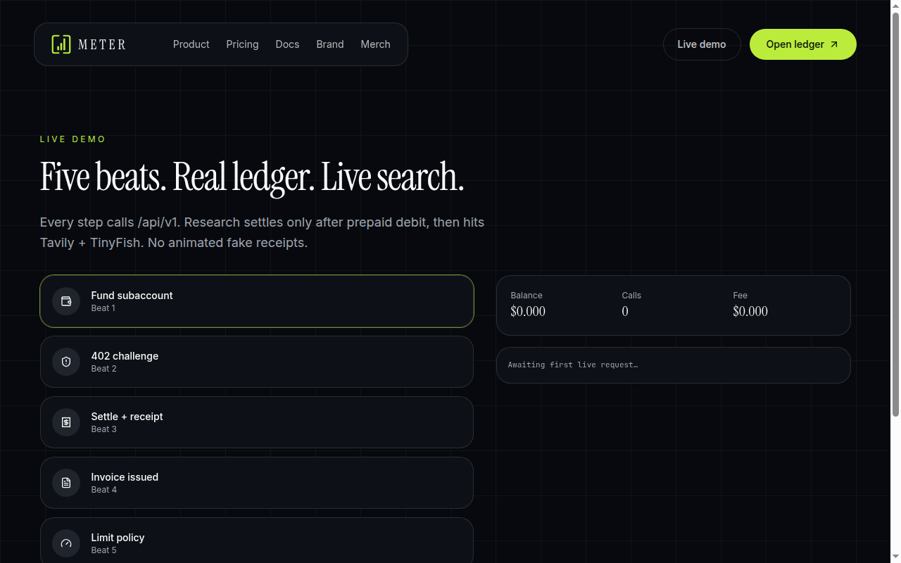
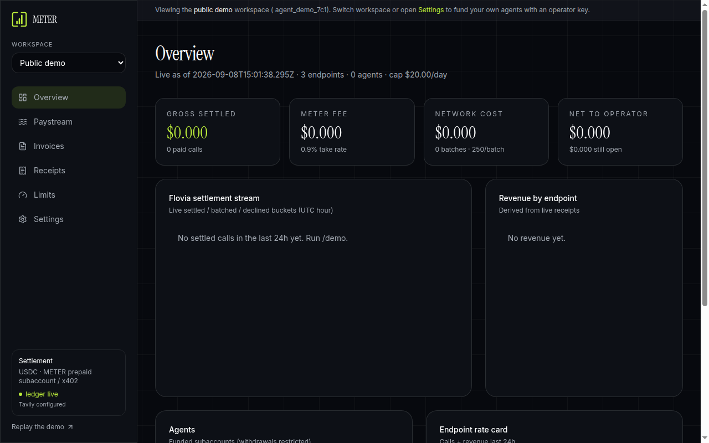
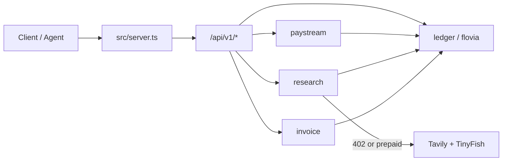

# METER

<p align="center">
  
</p>

<p align="center">
  <a href="https://www.binance.com/en/agent-os"></a>
  <a href="https://youtu.be/eqBMozL5CgU"></a>
  <a href="https://meter-sooty.vercel.app/demo"></a>
  <a href="https://meter-sooty.vercel.app/api/v1/health"></a>
  <a href="./SUBMIT.md"></a>
</p>

<p align="center">
  
  
  
  
  
  <a href="https://meter-sooty.vercel.app/api/v1/openapi.json"></a>
  <a href="https://meter-sooty.vercel.app/api/v1/mcp/skills"></a>
</p>

**Production:** https://meter-sooty.vercel.app · **Demo:** https://meter-sooty.vercel.app/demo · **Video:** https://youtu.be/eqBMozL5CgU · **GitHub:** https://github.com/henrysammarfo/meter

> When agents pay each other or charge for an API call, **METER** shows the money, writes a shared receipt, and settles it — inside limits you set.

---

## What's real vs what's deferred (read before judging)

| Surface | Status | Evidence |
|---|---|---|
| Unpaid research → **HTTP 402** | **Live** | `/demo` beat 2 · production API |
| Prepaid debit → Tavily + TinyFish → receipt | **Live** | `/demo` beat 3 · providers in response |
| Quote preview (price / balance / cap, no debit) | **Live** | `GET /api/v1/research/quote` |
| Shared invoice + demo mark-paid | **Live** | `/demo` beat 4 · `/api/v1/demo/invoice/pay` |
| **402 INSUFFICIENT_BALANCE** when empty | **Live** | `/demo` beat 5 · drain then prepaid call |
| Workspace **$20/UTC-day** cap | **Live** | `GET /api/v1/limits` · blocks with 429 |
| Flovia ledger dashboard | **Live** | `/dashboard` over real ledger rows |
| Browser Connect wallet (EIP-1193) | **Live (UI identity)** | MetaMask/Rabby/Coinbase · does **not** replace operator key |
| Public `/demo` session (seed → vault) | **Live** | No mainnet deposit required for contest path |
| Open x402 Base facilitator | **Configured when pay-to set** | Optional rail beside prepaid |
| Binance B402 merchant RSA settle | **Deferred** | Partner form blocked — documented, not faked |
| Multi-region durable ledger | **Not claimed** | Vercel `/tmp` is demo-durable per instance |
| “Unhackable” | **Never claimed** | Residual risk in [`memory/FACT_CHECK.md`](./memory/FACT_CHECK.md) |

Timed voiceover for the contest video: [`SUBMIT.md`](./SUBMIT.md).

---

## Why this wins Track A

Peers will ship chat wrappers and “I traded once” MCP demos.

**METER deletion test:** wipe the ledger → agents can still pay elsewhere, but **shared usage + invoice + receipt truth disappears**. That is the product.

| Judging lens | METER |
|---|---|
| Agent OS pay story | Live **HTTP 402** + prepaid debit before providers run |
| Shared truth | One ledger → receipts + invoices both sides can read |
| Limits | Workspace **$20/UTC-day** cap (x402 product law) |
| Honesty | B402 merchant form deferred — prepaid + open facilitator primary |

Contest kit (video script + X quote): [`SUBMIT.md`](./SUBMIT.md)

---

## Live product (no mocks)

<p align="center">
  <a href="https://youtu.be/eqBMozL5CgU">
    
  </a>
</p>

<p align="center"><em><a href="https://youtu.be/eqBMozL5CgU">Demo video</a> — Fund → 402 → quote+prepaid settle → invoice+pay → insufficient-balance 402 → $20/day cap</em></p>

<p align="center">
  
</p>

<p align="center"><em>/demo — interactive six-beat flow against real /api/v1</em></p>

<p align="center">
  
</p>

<p align="center"><em>/dashboard — shared Flovia ledger, workspace filter, settlement status live</em></p>

---

## Architecture

<p align="center">
  
</p>



```
Client / Agent
  → src/server.ts
    → src/meter/http.ts   (/api/v1/*)
      → paystream / research / invoice / flovia / ledger
    → TanStack Start (marketing + dashboard)
```

---

## Core capabilities

### 1. Live metered research (402 → prepaid)
Unpaid calls get a real **402 Payment Required**. Prepaid calls debit the agent subaccount **before** Tavily + TinyFish run; provider failure **refunds** the debit.

### 2. Shared receipts & agent↔agent invoices
Every settled call writes a receipt. Invoices roll unbilled receipts into one A2A object both sides can see.

### 3. Flovia ledger + daily cap
Dashboard + `GET /api/v1/ledger` show live volume, fees, agents, and limit utilization. Cap trips cleanly (429), not as a silent overspend.

### 4. Operator vault & multi-workspace UI
Browser vault stores operator key + agent tokens. Workspaces filter the shared ledger client-side (multi-tenant lite).

---

## Binance Agent OS surface map

| Pillar | METER surface | Status |
|---|---|---|
| **Pay / x402** | `GET /api/v1/research` → 402 or prepaid / optional Base mainnet facilitator | **Live** (prepaid primary) |
| **MCP / skills** | `GET /api/v1/mcp/skills` + OpenAPI | **Live** catalog |
| **Control / limits** | Operator key · agent tokens · `$20/day` workspace cap | **Live** |
| **Agentic wallet / B402 merchant** | Partner RSA `/papi/v2/b402/*` | **Deferred** (form blocked — documented, not faked) |

---

## Live API

| Method | Path | Job |
|---|---|---|
| GET | `/api/v1/health` | Provider + settle-rail wiring |
| GET | `/api/v1/health?deep=1` | Live network probes |
| POST | `/api/v1/subaccounts` | Fund agent (returns `agentToken` once) |
| GET/POST | `/api/v1/research?q=` | Paid research |
| POST | `/api/v1/invoices` | Issue from unbilled receipts |
| POST | `/api/v1/invoices/:id/pay` | Mark paid |
| GET | `/api/v1/ledger` | Flovia overview |
| GET | `/api/v1/limits` | Cap utilization |
| GET | `/api/v1/openapi.json` | Machine-readable surface |
| GET | `/api/v1/mcp/skills` | Skill catalog |
| POST | `/api/v1/demo/seed` | Public demo fund |
| POST | `/api/v1/demo/invoice` | Public demo invoice |
| POST | `/api/v1/demo/invoice/pay` | Mark demo invoice paid |
| POST | `/api/v1/demo/drain` | Zero demo balance (for insufficient-balance proof) |
| GET | `/api/v1/research/quote` | OKX-style price/balance/cap preview (no debit) |
| POST | `/api/v1/waitlist` | Access waitlist |

Prepaid headers: `X-Meter-Agent-Id`, `X-Meter-Agent-Token`, `X-Meter-Payment: prepaid`.

---

## Settle rails

| Rail | Status | Needs |
|---|---|---|
| Prepaid ledger | **Live** | Fund subaccount + agent token |
| Open x402 · Base mainnet (`facilitator.payai.network`) | Optional / configured when pay-to set | `METER_PAY_TO` + USDC `0x833589fCD6eDb6E08f4c7C32D4f71b54bdA02913` |
| Binance B402 merchant | Deferred | Partner form / RSA onboarding |

Details: [`memory/SETTLE_RAILS.md`](./memory/SETTLE_RAILS.md)

---

## Quickstart

```sh
cp .env.example .env   # TAVILY_API_KEY, TINYFISH_API_KEY, METER_OPERATOR_KEY, optional AGENT_ROUTER_*
npm i
npm run dev
npm run smoke          # health → waitlist → fund → 402 → paid research → invoice → ledger → stress×5
```

Try production without installing: https://meter-sooty.vercel.app/demo

---

## What we can still add

### Owner (contest bottleneck — today)

1. ~~**60–120s demo video**~~ → https://youtu.be/eqBMozL5CgU (**done**)
2. Follow @Binance · **repost** official post · **quote** with video + GitHub + production URL
3. Hackathon **survey** + jurisdiction check
4. **Rotate** the Vercel token that was pasted in chat

### Packaging (high leverage, no UI rewrite)

| Add | Why | Status |
|---|---|---|
| Netro-style README hero + badges + architecture SVG | Judges land on GitHub first | **Done** |
| Honest “what's real vs deferred” table | Afterimage-style packaging discipline | **Done** |
| Timed voiceover script in SUBMIT.md | Judges hear the deletion test + live 402 path | **Done** |
| Live `/demo` + `/dashboard` screenshots in README | Proof without clicking | **Done** |
| OG image + meta (`og-meter.png`) for X/Discord unfurl | Link previews look finished | **Done** |
| Contest **demo video** on YouTube | Motion packaging for judges / X quote | **Done** — https://youtu.be/eqBMozL5CgU |

### Product (post-submit)

- Server-side workspace partition (beyond client-side filter)
- Durable ledger beyond Vercel `/tmp` (demo-durable per instance today)
- B402 RSA client when merchant credentials exist
- Optional Venice LLM only if you want synthesis beyond AgentRouter

---

## Doctrine

No mocks. No silent fallbacks. Not “unhackable” — residual risk (serverless ledger path, deferred B402, WAF egress for some LLM hosts) is documented in [`memory/FACT_CHECK.md`](./memory/FACT_CHECK.md).
